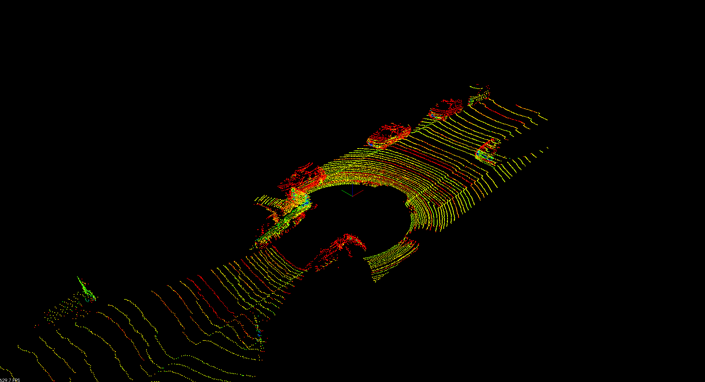
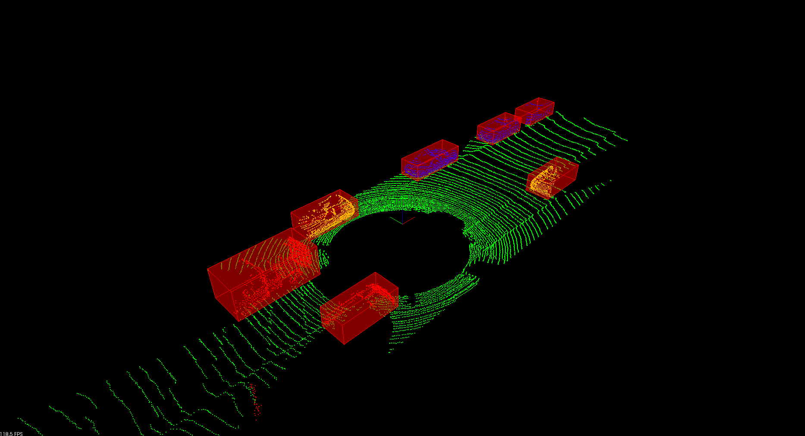
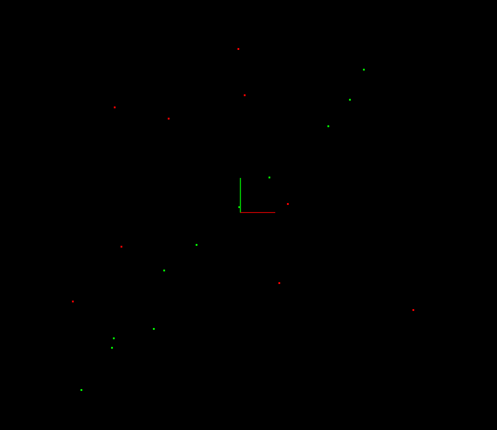
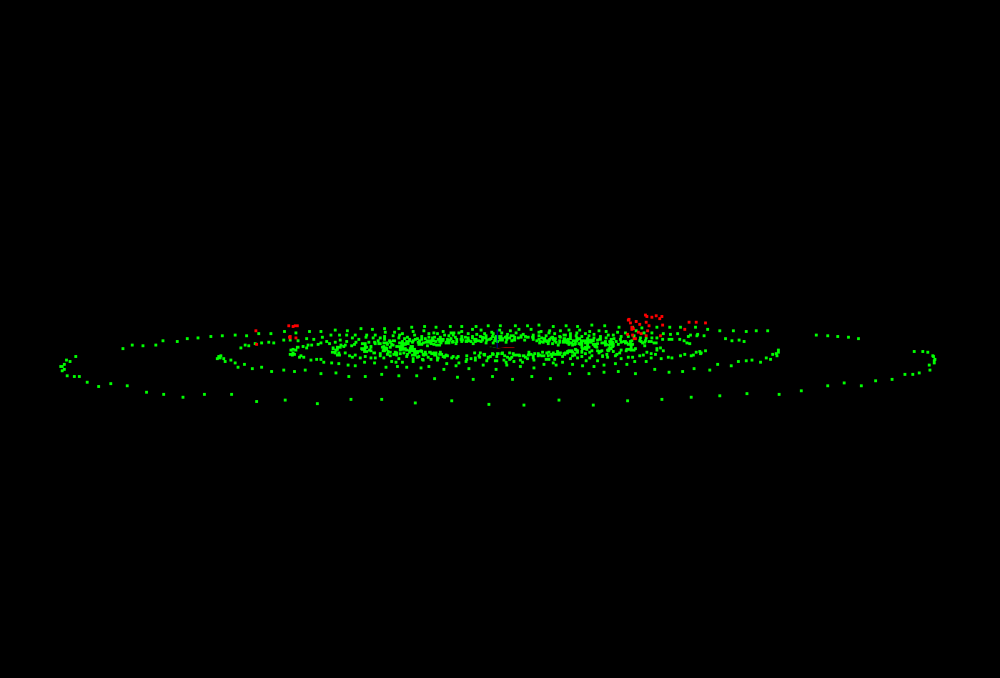
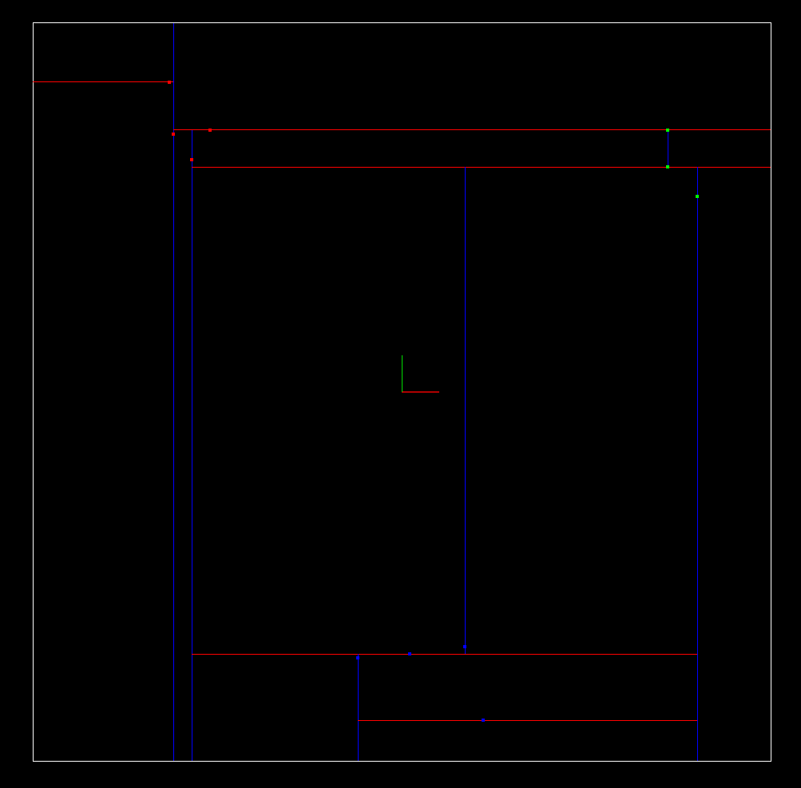
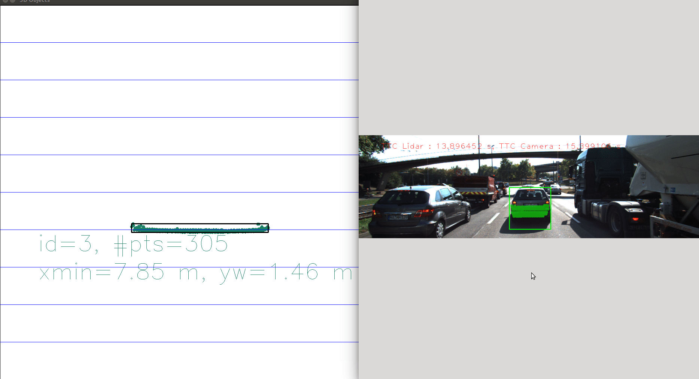
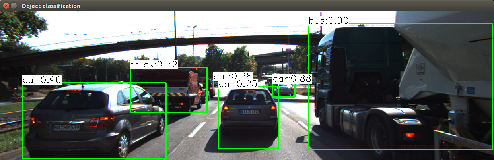
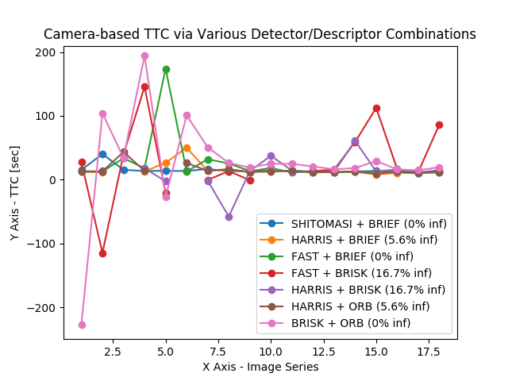
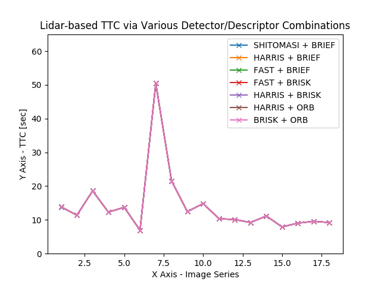

# UdacitySensorFusion
Course metrials and projects of Udacity Sensor Fusion Nanodegree Program.

## Lidar Obstacle Detection

* Contained in the folder [lidar_obstacle_detection](lidar_obstacle_detection/)
* Implemented a 3D lidar object detection, which contains several classical algoirthm:
    * Raw Lidar Point Clouds rendering: check the [top left gif](lidar_obstacle_detection/media/process-lidar-raw.gif)
    * Processed result rendering with bounding boxes: check the [top right gif](lidar_obstacle_detection/media/process-lidar-bbox.gif)
    * Lidar point clouds **segmentation** using the [RANSAC](lidar_obstacle_detection/src/quiz/ransac/) technique ([Wiki page](https://en.wikipedia.org/wiki/Random_sample_consensus))
    * Lidar point clouds **clustering** using [kd-tree](lidar_obstacle_detection/src/quiz/cluster/) algorithm ([Wiki page](https://en.wikipedia.org/wiki/K-d_tree))

| Type |  RANSAC 2D Line Fitting   | RANSAC 3D Plane Fitting | Kd-tree Clustering | 
| --- | --- | --- | --- |
| Result |   |  |  |
| Source code | [RANSAC 2D source code](lidar_obstacle_detection/src/quiz/ransac/ransac2d.cpp) | [RANSAC 3D source code](lidar_obstacle_detection/src/quiz/ransac/ransac3d.cpp) | [Kd-tree source code](lidar_obstacle_detection/src/quiz/cluster/kdtree.h) |

## Camera

* 2D Feature Tracking
    * Implemented classic image feature detection, description as well as matching within `OpenCV`:
        * Keypoints detectors: implemented based on **intensity gradients** such as `HARRIS`, `SHITOMASI`, etc, as well as **Non-maximum Suppression (NMP)** technique for clearing overlapping of keypoints
        * Descriptors: applied `OpenCV` built-in descriptors, including **Histograms of Oriented (HoG)** based descriptors such as `SIFT` and `SURF`, as well as **Binary Descriptors** such as `BRISK`, `BRISK`, `ORB` and `AKAZE`.
        * Descriotpr Matching: implemented manually about `L1`, `L2` norms matching, as well as **K Nearest Neighbor** matching algorithm based on distances / ratios
    * Performed analysis on different combinations of detector / descriptor / matching to evaluate overall performance
    * Refer to [2D Feature Tracking Page](camera_object_detection/Mid_Term_Proj_2D_Feature_Tracking/) for further details 
* 3D Object Tracking
    * Applied YOLOv3 object detection with trained model and generated bounding boxes for detected objects
    * Implemented 3D lidar point clouds projection on 2D camera image
    * Calculated **Time-to-Collision (TTC)** based on 2D camera image keypoints matching, and projected 3D lidar point clouds on 2D images 
    * Conducted analysis of performance of camera TTC via various combinations of detector / descriptor
    * Refer to [3D Object Tracking Page](camera_object_detection/Final_Term_3D_Object_Tracking/) for further details 

| Camera based TTC | Lidar based TTC |
| --- | --- |
|  |  |
## Radar
* On-going