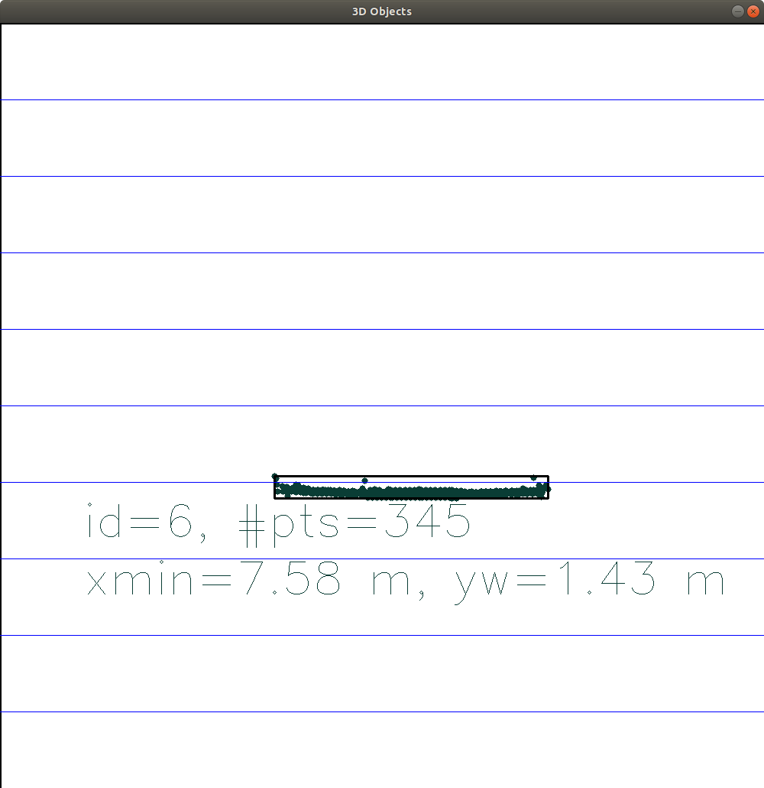
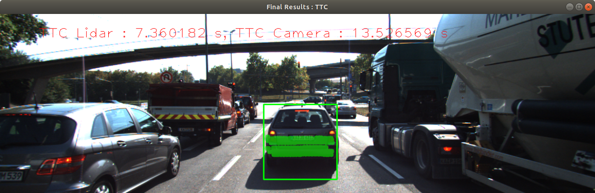
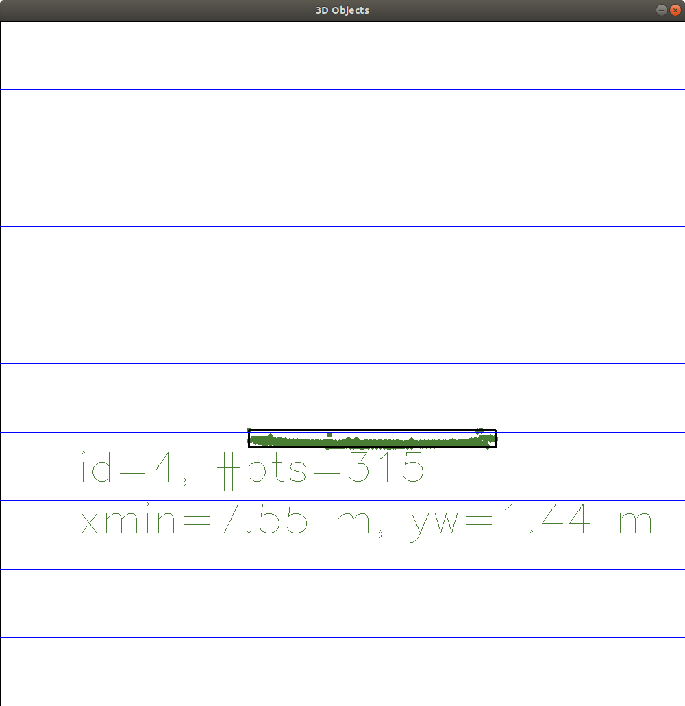
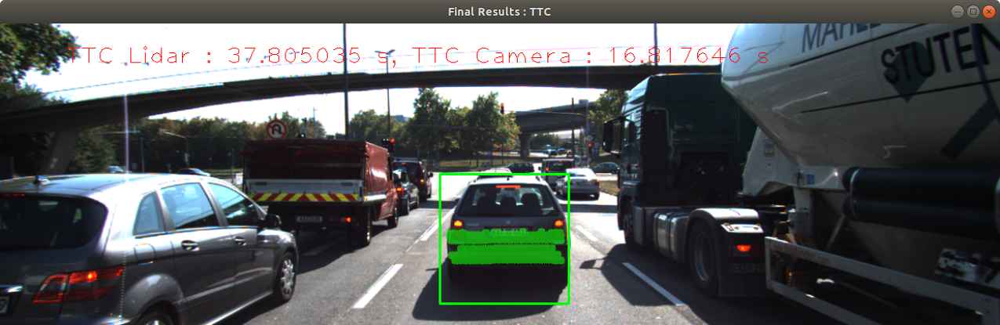

# SFND 3D Object Tracking

## TTC Performance Evaluation
### Evaluation 1: Example about TTC Estimation based on Lidar Data Not Seems Plausible
* Example: As shown in the pictures below, if using the expression `TTC = minXCurr * dT / (minXPrev - minXCurr)` to calculate `TTC`(estimated via lidar), it's easily found in the Step 1 the value  is only *7.36 s* while in the Step 2 the value jumps to *37.81 s*. We can look into the Lidar Point Cloud image, and it actually makes sense. The reason is that, the expression `minXCurr * dT / (minXPrev - minXCurr)` is very sensitive to the denominator `(minXPrev - minXCurr)`, because `minXPrev` and `minXCurr` has very close value, so the difference is very close to 0, which means **a slight detection deviation can cause big jump in the TTC output**. A corresponding way to solve this issue could be introducing a *moving median filer*, which has not been implemented yet due to time limitation.

| Time Step |  Lidar Point Cloud  | Camera Image | 
| --- | --- | --- |
| Step 1 |   |  |
| Step 2 |  |  |

### Evaluation 2: Analysis Performance of Camera TTC via Various Combinations of Detector / Descriptor
* A series of experiments have been conducted and a graph has been obtained to illustrate the findings. According to the graph, one can evaluate the distribution of TTC values. Note some of them has value **`+/-inf`** (also in the graph, a percentage of `inf` has been analyzed), as invalid output has been detected. The main reason is that the specific detector / descriptor combination is not appropriate to extract and match the keypoints very well, which means one should avoid those combinations in the TTC calculation.
* In conclusion, **`SHITOMASI` + `BRIEF`** is the best combination in terms of TTC calculation, while **`FAST` + `BRIEF`** might be a good alternative, as shown in the left graph (refer [the python script](src/compare_camera_results.py) for source code of the graph). The rest of the choices are either involved with too many invalid detections or too high uncertainties, due to bad detection, description or matching, which makes them imappropriate to conduct the job of TTC calculation.
* In addition, compared to lidar based TTC calculation as is shown in the right side, camera based technologies have higher uncertainty, which is esentially dependent on different combinations of detector / descriptor.

| Camera based TTC | Lidar based TTC |
| --- | --- |
|  |  |
# Background
Welcome to the final project of the camera course. By completing all the lessons, you now have a solid understanding of keypoint detectors, descriptors, and methods to match them between successive images. Also, you know how to detect objects in an image using the YOLO deep-learning framework. And finally, you know how to associate regions in a camera image with Lidar points in 3D space. Let's take a look at our program schematic to see what we already have accomplished and what's still missing.

In this final project, you will implement the missing parts in the schematic. To do this, you will complete four major tasks: 
1. First, you will develop a way to match 3D objects over time by using keypoint correspondences. 
2. Second, you will compute the TTC based on Lidar measurements. 
3. You will then proceed to do the same using the camera, which requires to first associate keypoint matches to regions of interest and then to compute the TTC based on those matches. 
4. And lastly, you will conduct various tests with the framework. Your goal is to identify the most suitable detector/descriptor combination for TTC estimation and also to search for problems that can lead to faulty measurements by the camera or Lidar sensor. In the last course of this Nanodegree, you will learn about the Kalman filter, which is a great way to combine the two independent TTC measurements into an improved version which is much more reliable than a single sensor alone can be. But before we think about such things, let us focus on your final project in the camera course. 

## Dependencies for Running Locally
* cmake >= 2.8
  * All OSes: [click here for installation instructions](https://cmake.org/install/)
* make >= 4.1 (Linux, Mac), 3.81 (Windows)
  * Linux: make is installed by default on most Linux distros
  * Mac: [install Xcode command line tools to get make](https://developer.apple.com/xcode/features/)
  * Windows: [Click here for installation instructions](http://gnuwin32.sourceforge.net/packages/make.htm)
* OpenCV >= 4.1
  * This must be compiled from source using the `-D OPENCV_ENABLE_NONFREE=ON` cmake flag for testing the SIFT and SURF detectors.
  * The OpenCV 4.1.0 source code can be found [here](https://github.com/opencv/opencv/tree/4.1.0)
* gcc/g++ >= 5.4
  * Linux: gcc / g++ is installed by default on most Linux distros
  * Mac: same deal as make - [install Xcode command line tools](https://developer.apple.com/xcode/features/)
  * Windows: recommend using [MinGW](http://www.mingw.org/)

## Basic Build Instructions

1. Clone this repo.
2. Make a build directory in the top level project directory: `mkdir build && cd build`
3. Compile: `cmake .. && make`
4. Run it: `./3D_object_tracking`.