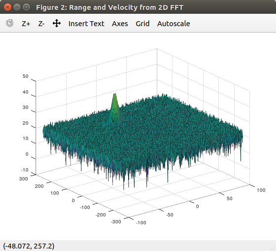
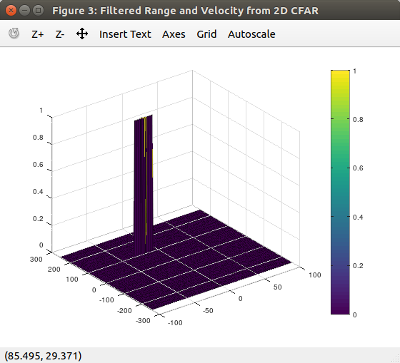

# Radar Target Generation and Detection

## 2D CFAR Evaluation
| Source / Input (from 2D `FFT`) | Result / Output of 2D `CFAR` |
| ---  | ---  |
|  |    |
### Background
* The 2D CFAR algorithm takes the 2D FFT result, the complete Range Dopper Map (the variable `RDM` in the script) as its input, then the algorithm applies sliding window through the input, and during each iteration it conducts averaging of surrounding cell values of the interested cell (i.e., the **Cell Under Test (CUT)**), to take as threshold of the CUT.

* The performance of the 2D CFAR is closely related to the selection of those critical parameters:
    * `Tr`: Number of Training Cells on range dimension
    * `Td`: Number of Training Cells on Doppler dimension
    * `Gr`: Number of Guard Cells on range dimension
    * `Gd`: Number of Guard Cells on Doppler dimension
    * `SNR`: Offset Threshold after averaging interested cells

### Implementation
Here's a brief list of steps to implement the ***2D CFAR algorithm***:
* Define a set of choices of the critical parameters: `Tr`, `Td`, `Gr`, `Gd` and `SNR`
* Start a sliding window through the input `RDM` on both *range dimemsion* and *Doppler Dimension*, on each dimension the note the boundary limit, should be seriously considered first, i.e., iterators `i` and `j` shall not cross some limits
* In each of iteration described above: 
    * take average on all the training cells around the interested cell (aka, `CUT`), and generate a `threshold` value based on the average as well as the offset `SNR`
    * assign signal values according to the `threshold`, if above then `1`, else `0`
* Plot the processed signal map

### Parameters Selection
To achieve better performance of 2D CFAR, the selection of the critical paramters matter on the results. According to the experiments conducted, some learnings have been taken for parameters selection:
* Numbers of training cells on both dim (`Tr` and `Td`) cannot be too small, should be at least ~10
* Numbers of guard cells on both dim (`Gr` and `Gd`) shall be smaller than training cells, usually at around the range of half
* The `SNR` offset also has be chosen on a reasonable range, neither too large nor too small makes sense
* After quite a lot of experiments, the following set of paramters is utilized:

| `Tr` | `Td` | `Gr` | `Gd` |`SNR` |
| ---  | ---  | ---  | ---  | ---  |
| 12   | 14   | 6    | 8    | 5    |
 
### Boundary Effect Avoidance
As discussed above, the `CUT`s cannot be located around the boundary region / edges of the `RDM` matrix due to the presence of training and guard cells. Thus, those edge cells have been preliminarily set to `0`, as they are not going to be processed.
